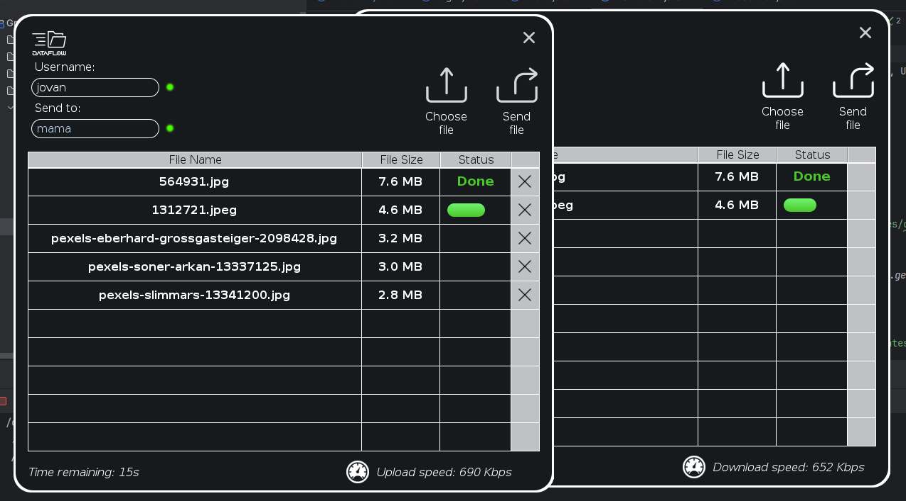
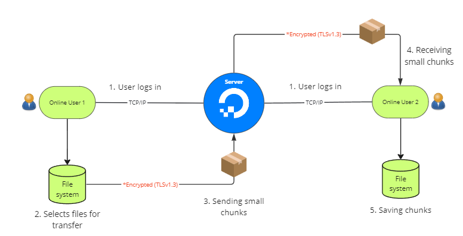
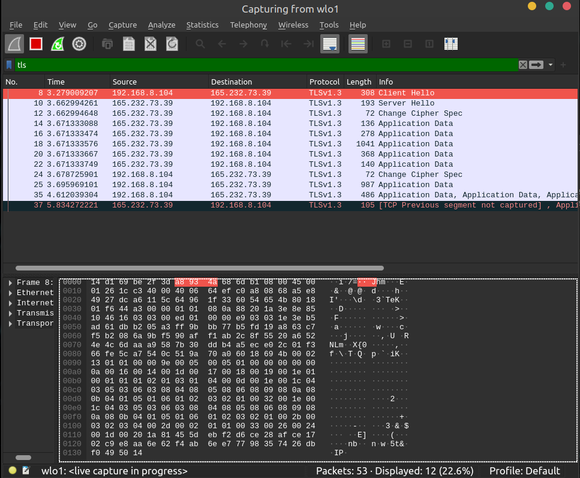

# DataFlow(v1.0)

Welcome to DataFlow – Where File Transfer is a Breeze! Ready to break free from the constraints of file size limits and unreliable transfers? Say hello to DataFlow, your go-to solution for seamless and secure file transfers of any size. From crucial documents to hefty multimedia files and large datasets, DataFlow ensures your files reach their destination swiftly and securely. Get ready to experience the magic of effortless file transfers with DataFlow today!

DataFlow isn't just another file transfer tool – it's a game-changer! Our platform offers a robust and user-friendly experience, complete with features like end-to-end encryption, real-time progress tracking, and a sleek interface designed for ultimate convenience. Whether you're collaborating with colleagues, sharing files with clients, or sending memories to friends, DataFlow guarantees your files arrive safe and sound, right on schedule. Say goodbye to file transfer headaches and hello to a new era of seamless sharing with DataFlow!   You can download the app <a href="http://datafl0w.com">here</a>.

## User Privacy:
DataFlow prioritizes user privacy by not storing any user information on the server. Files are transferred directly to end-users without compromising user data integrity.

## New Protocol:
DataFlow adopts a revolutionary green protocol that optimizes file transfer efficiency. Users can send files of any size, up to hexabytes, ensuring a scalable and versatile file-sharing experience.

  

## Secure Data Encryption:
The app uses TLS 1.3 to encrypt data during transmission, ensuring the highest level of security for file transfers. All information sent via Dataflow is encrypted, providing a robust layer of protection for user data.

